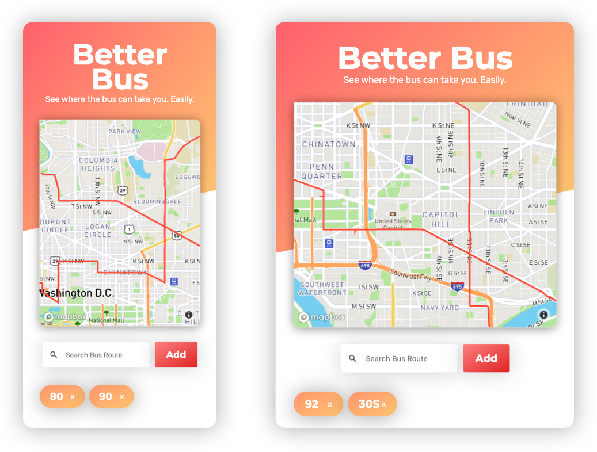

# Better Bus
I live in Washington DC, where the Bus System is pretty robust. I have 5+ bus stops literally within eye distance of my house; yet I have found it difficult to find a resource which easily shows where each of those stops can take me all on one screen. The two options availible are:

* Aggregate time tables for all buses, which don't show the geospatial path of the bus route
* [Map resources](https://www.wmata.com/schedules/maps/) which allow you to show an individual bus route on a map one at a time

I wanted to make an app where I could type in the bus numbers that service a particular stop, and see where I could get to from that particular stop. I built this with a few technologies I was interested in taking a deeper look at.


* [Next JS](https://github.com/zeit/next.js).
* [Mapbox](https://www.mapbox.com/)
* [React Map GL](https://github.com/visgl/react-map-gl)
* [WMATA API](https://developer.wmata.com/)
* [React Transition Group](https://github.com/danmostudco/ReactTransitionGroupExample)
* [Deployed with Now](https://github.com/zeit/now)

# The App
<br />
This app builds a very simple application which allows you to type in the name of a bus route and see it on a map. The magic is that you can do this for multiple bus routes at a time, without having to clear the map.

* Search for multiple bus route, add it to the map
* View multiple routes on the same map
* Tap on the route to remove it from the map

## Running and Deploying the App

Per usual, `use npm install` to get all the dependencies. 

### Add a WMATA_API_KEY to a .env file
You can get your own (developer API key from WMATA)[https://developer.wmata.com/] and put that in a .env file stored in the root directory. In the project directory, you can run:

```
WMATA_API_KEY=[your API key here]
```

### Get a Mapbox token
You will need to get a [Mapbox Access Token](https://docs.mapbox.com/help/how-mapbox-works/access-tokens/) for an application. I stored mine in a file called `mapboxaccesstoken.js` at the root of the directory, and then exported that string to be used in `/components/Map.js`.


### `npm run dev`

Runs the app in the development mode.<br />
Open (http://localhost:3000)[http://localhost:3000] to view it in the browser.

The page will reload if you make any edits.<br />

### `npm run build`

Creates an optimized production build. I didn't use this capability as I needed to utilize [API Routes](https://nextjs.org/docs/api-routes/introduction) of NextJS to hide my API keys, so I ended up using the Now CLI, developing with `now dev` and deploying with `now prod`. I then used their [Zero-Config deployments dashboard](https://vercel.com/docs/v2/build-step#environment-variables) to store my API Keys.